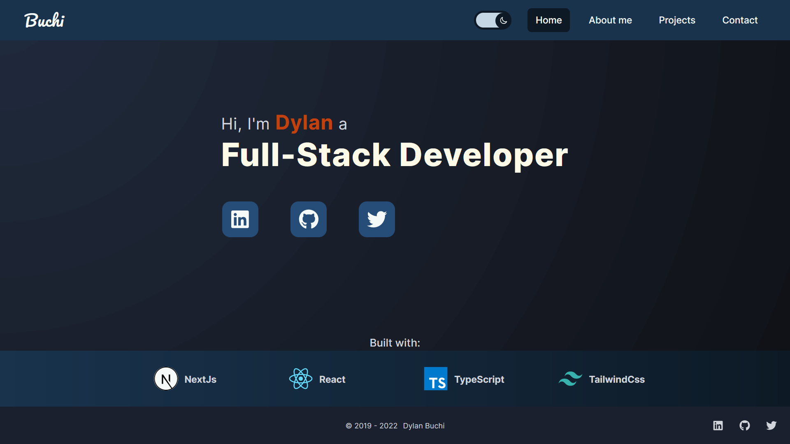
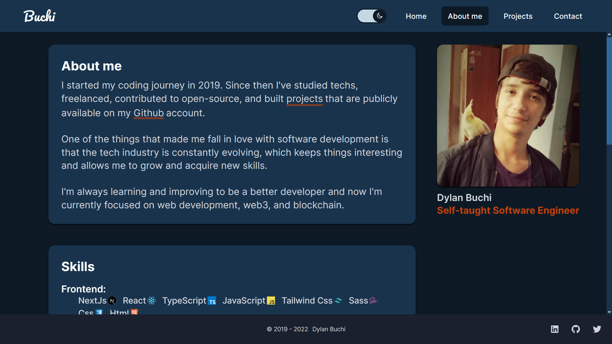
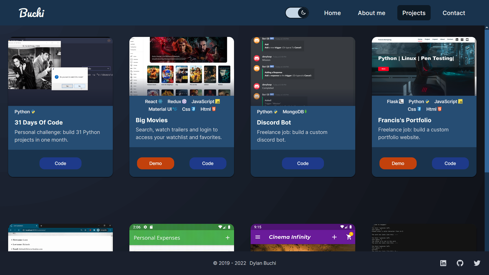
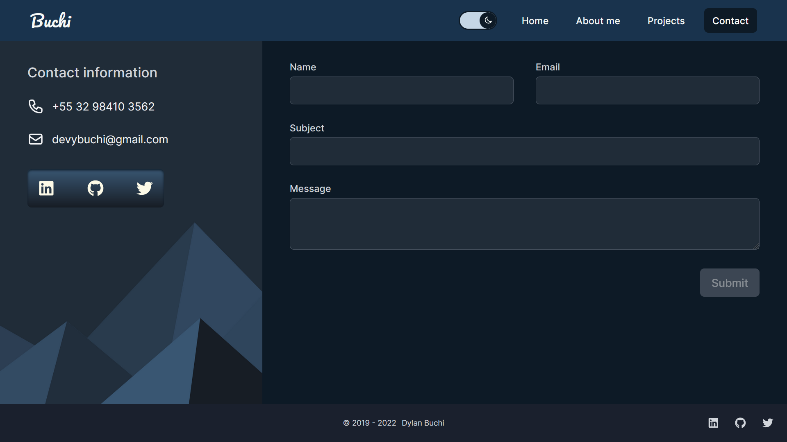

# Welcome to my portfolio

## Website: https://dylanbuchi.com

### Built with:

---

---

# ⌨️ Commands

All commands are run from the root of the project, from a terminal:

| Command         | Action                                         |
| :-------------- | :--------------------------------------------- |
| `npm install`   | Installs dependencies                          |
| `npm run dev`   | Starts local dev server at `localhost:3000`    |
| `npm run build` | Build your production site                     |
| `npm start`     | Preview your build locally, before deploying   |
| `npm run lint`  | Run code quality tools, e.g. ESLint, TSLint... |
